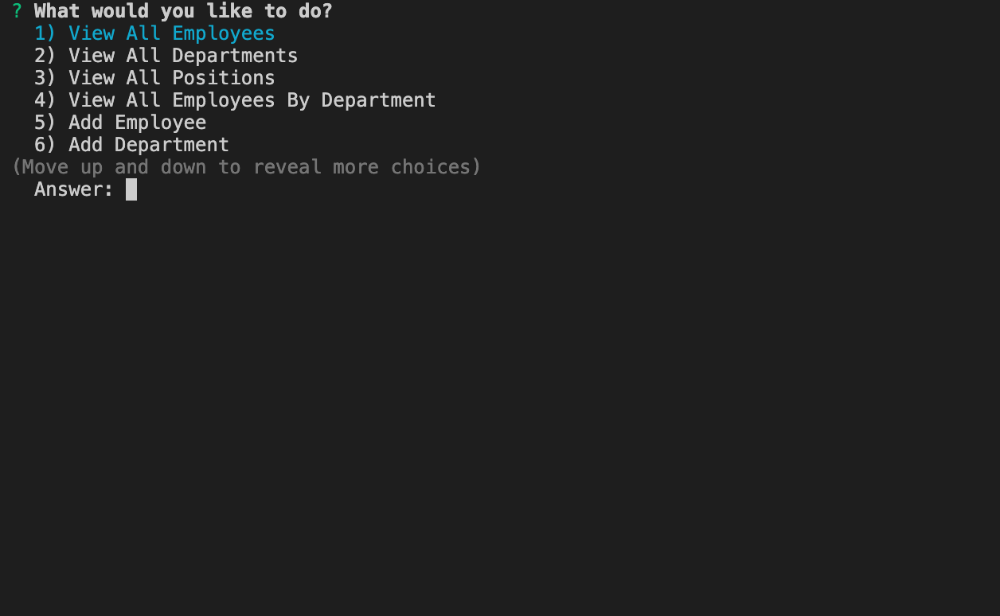
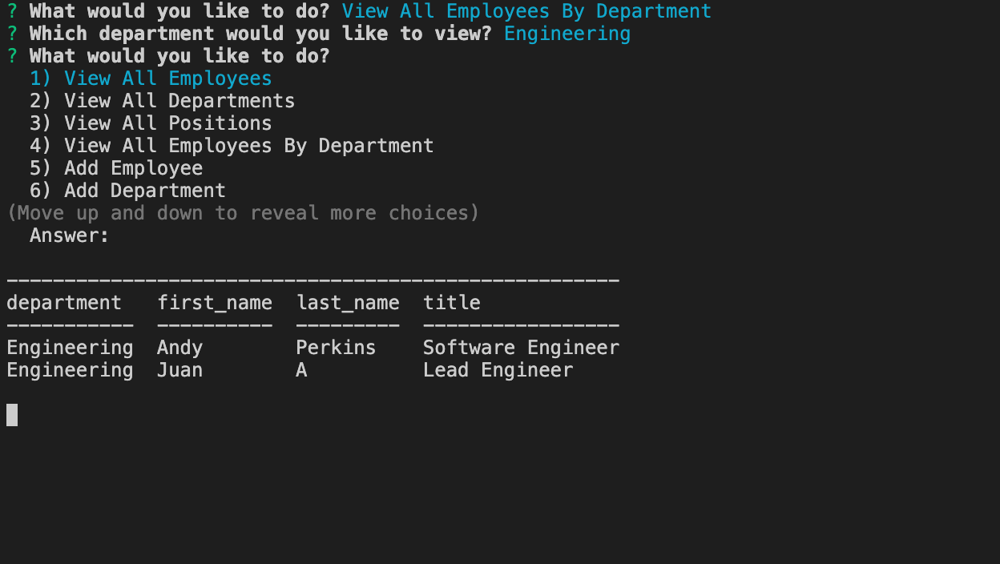
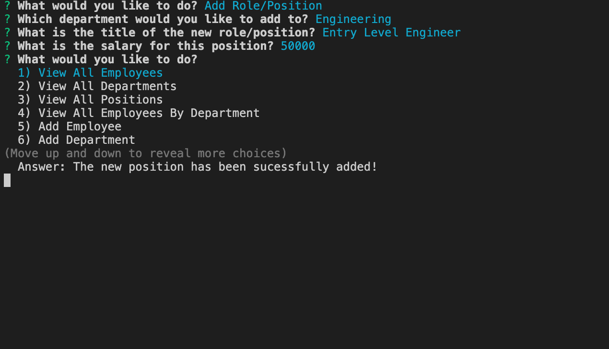

# employee-tracker
CLI application that allows user to view, add, and update employees using node (inquirer and MySQL)

## Description 
The purpose of this application is to create a **C**ontent **M**anagement **S**ystem to allow the user to Create, Read, Update, and Delete (CRUD) information from a database without needing any knowledge or syntax that goes in working with databases like SQL. The user is able to perform any of the CRUD operations directly from the command line by selecting from a list of options. 

In this app, the user is able to access and work with information about employees in a given workspace, where departments, positions/roles, and employee information can be updated. 

## User Story
As a business owner 
I want to be able to view and manage the departments, roles, and employees in my company 
So that I can organize and plan my business

## Tools
JavaScript, Node.js (Inquirer & MySQL modules), MySQL

## Images

